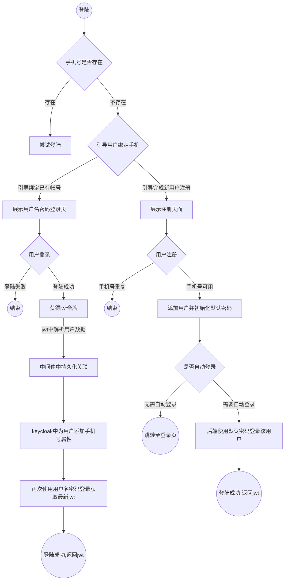

# keycloak-login-spi

### 功能描述
拓展 keycloak 提供诸如 “手机验证码登录“ 等登录功能

### 设计思路
通过对 oauth2 中 grant_type: password 的登陆模式进行拓展
提供新的登录入参并重写登录实现逻辑

选择 Custome Login Authenticator 作为 Authentication Flow 时
将会串行执行其中包含的多个 execution (Login Authenticator Implement)
通过判断新增的参数 login_type , 仅有一个 execution 会作为实际的鉴权过程


### 使用流程
#### 一、下载解压 keycloak server

https://www.keycloak.org/downloads.html

#### 二、使用自定义插件

https://moz-kamen.github.io/keycloak/keycloak_login_spi/keycloak-login-spi-1.0.0-SNAPSHOT.jar

在 ***keycloak*** 根目录下创建 ***providers*** 文件夹

将自定义插件放入改文件夹中, 执行以下启动 ***keycloak*** 

###### windows : ***$keycloak/bin/standalone.bat*** 

###### linux : ***$keycloak/bin/standalone.sh*** 


#### 三、创建 Authentication

1、新增 authentication flow

***点击新增按钮 :***


***填写 alias 点击保存 :***


#### 四、创建 client 并指定接口登录校验方式

***点击创建 client :***


***填写 client Id , 选择 openid-connect :***


***完成创建后进入编辑页，settings最下方 , 选择上一步创建的 authentication flow 并保存  :***


#### 五、创建用户


***编辑用户属性 :***


#### 六、配置自定义登录流程

***编辑 Authentication 并添加 execution :***


***设置 execution可用 :***


***添加配置 :***


***推荐完整配置 :***


---

###### 1、密码登陆模式

---

***config :***

```txt
# 登录接口用户名字段名
# eg: username
login form key - username

# 登录接口密码字段名
# eg: password
login form key - password

```

***request :***

```txt
POST http://localhost:8080/auth/realms/master/protocol/openid-connect/token

Content-Type:application/x-www-form-urlencoded

grant_type:password
client_id:client001
login_type:password
username:liang.xu
password:123456
```


---

###### 2、手机验证码模式

---

***config :***

```txt
# 使用手机号检索用户时，所用 keycloak user attribute 的字段名
# eg: phone
user attribute key - phone

# 登录接口手机号字段名
# eg: phone
login form key - phone 

# 登录接口手机验证码字段名
# eg: code
login form key - code

# 短信校验请求地址
# eg: https://localhost:8080/v1/verifycode/checkcode
sms request url

# 短信校验请求方式 ( get / post.form / post.json )
# eg: post.json
sms request method

# 请求短信服务时默认请求参数，json格式，用于配置常量参数，例如模板类型
# eg: {"clientId": "AAABBB"}
sms request param - default

# 请求短信服务时传入手机号的字段名称
# eg: phone
sms request param - phone

# 请求短信服务时传入验证码的字段名称
# eg: code
sms request param - code

# 短信服务返回值用于确认是否成功的字段名(多个json层级使用.取下级键)
# eg: data.successFlag
sms response check - key

# 短信服务返回值用于确认是否成功的字段值，会根据实际返回值类型转换后校验
# eg: true
sms response check - value
```

***request :***

```txt
POST http://localhost:8080/auth/realms/master/protocol/openid-connect/token

Content-Type:application/x-www-form-urlencoded

grant_type:password
client_id:client001
login_type:phone
phone:18355512590
code:1234
```


---

###### 3、微信登录模式

---

***config :***

```
# 使用微信号检索用户时，所用 keycloak user attribute 的字段名
# eg: wechat_unionid
user attribute key - wechat unionid

# 登录接口微信号字段名
# eg: wechat_unionid
login form key - wechat unionid
```

***request :***

```txt
POST http://localhost:8080/auth/realms/master/protocol/openid-connect/token

Content-Type:application/x-www-form-urlencoded

grant_type:password
client_id:client001
login_type:wechat
wechat_unionid:wx_123456
```


#### 七、Keycloak部分接口说明

***官方接口文档地址 :***

https://www.keycloak.org/docs-api/8.0/rest-api/index.html

调用admin相关接口需要传入授权令牌

可以使用root用户先以接口方式获取授权令牌，再用来调用以下接口

root授权令牌默认超时时间为1分钟


###### 1、新增用户

```txt
POST http://localhost:8080/auth/admin/realms/master/users

Content-Type:application/json

{
	"username": "liang.xu2",
	"credentials": [{
		"type": "password",
		"value": "liang.xu2",
		"temporary": false
	}],
	"enabled": true
}
```


###### 2、使用用户名查询用户

>可通过此接口获取用户id
>
>该查询为模糊查询，查询结果需要二次校验用户名是否匹配

```
GET http://localhost:8080/auth/admin/realms/master/users?username=liang.xu2
```


###### 3、重置密码

```
PUT http://localhost:8080/auth/admin/realms/master/users/{id}/reset-password

Content-Type:application/json

{
	"type": "password",
    "value": "123456",
    "temporary": false
}
```


###### 3、为用户添加属性

>更新用户属性仅有全量更新的方式可用，所以需要先查询出用户已有属性，在新增属性后，将全量属性更新到用户信息中。
>
>此处应该将查询到更新完成应保证事务的原子性，可使用分布式锁实现

```txt
GET http://localhost:8080/auth/admin/realms/master/users/{id}
```

```txt
PUT http://localhost:8080/auth/admin/realms/master/users/{id}

Content-Type:application/json

{
	"attributes": {
		"phone": "12300000000"
	}
}
```


#### 八、自定义登录设计思路

>由于 keycloak 未提供使用用户自定义属性检索用户的 rest 接口，所以也无法对自定义属性进行重复校验
>
>推荐对接 keycloak 对外提供服务的中间件应当持久化用户与第三方登录所需唯一键的映射关系
>
>用来完成用户是否已存在，以及第三方唯一键是否重复等相关校验
>
>但需要保证所有映射关系的添加都经过中间件，而不是直接在 keycloak 管理页面完成


***手机登录流程图 :***




***微信登录流程图 :***


***登录鉴权时序图 :·***

```sequence
participant front end as A
participant gateway as B
participant back end as C
participant idp middleware as D
participant keycloak as E

A -> D: 请求登录
D -> E: 请求登录
E --> D: 登陆成功，返回授权令牌及刷新令牌
D --> D: 加密授权令牌
D --> D: 缓存授权令牌与刷新令牌关系
D --> A: 返回加密后的授权令牌和基本用户信息
A -> B: 携带有效授权令牌访问网关
B -> D: 校验授权令牌是否有效
D --> D: 解密并校验授权令牌
D --> B: 返回用户信息
B -> C: 携带登录用户信息请求
C --> B: 返回响应
B --> A: 返回响应

A -> B: 携带过期的授权令牌访问网关
B -> D: 校验授权令牌是否有效
D --> D: 解密并校验授权令牌
D -> E: 请求刷新授权令牌
E --> D: 返回新的授权令牌及刷新令牌
D --> D: 加密授权令牌
D --> D: 缓存授权令牌与刷新令牌关系
D --> B: 返回加密后的授权令牌及用户信息
B -> C: 携带登录用户信息请求
C --> B: 返回响应
B --> A: 返回响应并在请求头中发放新的授权令牌

A -> B: 携带刷新令牌过期的授权令牌访问网关
B -> D: 校验授权令牌是否有效
D --> D: 解密并校验授权令牌
D -> E: 请求刷新授权令牌
E --> D: 刷新令牌无效
D --> B: 授权令牌校验失败
B --> A: 失败重定向登录
```

